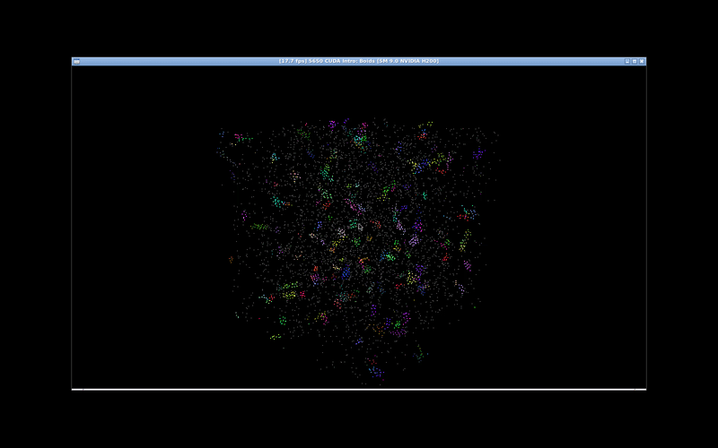
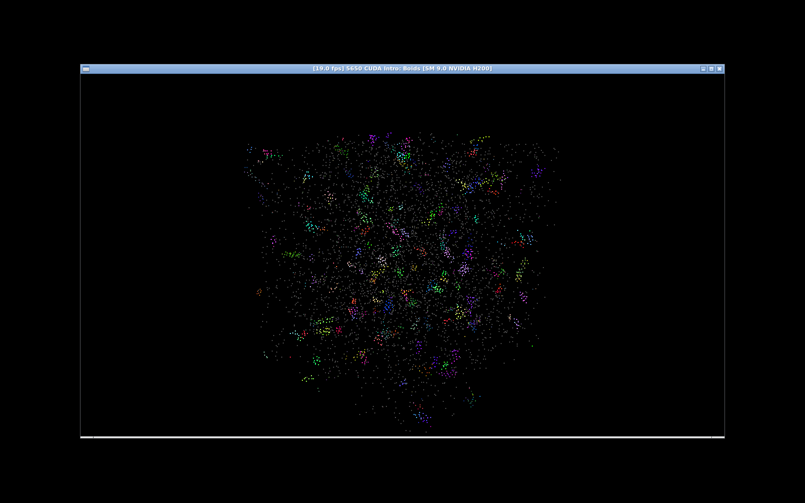
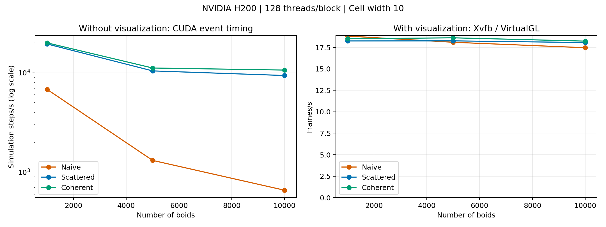
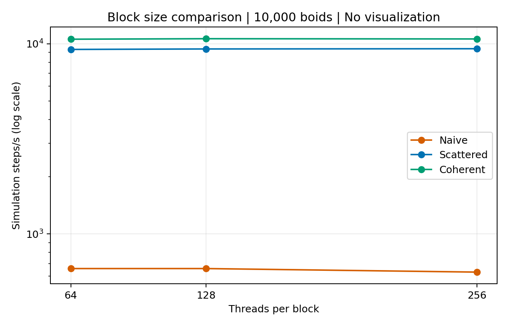
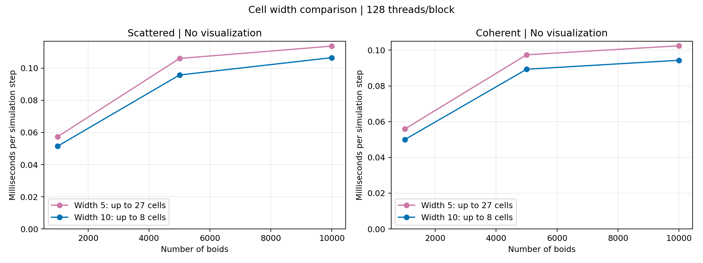

**University of Pennsylvania, CIS 5650: GPU Programming and Architecture,
Project 1 - Flocking**

* Qingying Li
  * [LinkedIn](https://www.linkedin.com/in/harper-li-292730373/)
* Tested on: personal MacBook Pro, Apple M1 Pro, macOS (VS Code and SSH); lab-provided NVIDIA H200 server, Ubuntu 22.04 Docker container, CUDA Toolkit 12.4, CMake 3.22.1.

### Flocking Demonstration

The coherent uniform grid simulation with 5,000 boids on an NVIDIA H200. Colors are derived from velocity components, so boids with similar velocities appear in similar colors.

The animation uses a fixed camera and was recorded at 10 frames per second. This is the recording rate, not a benchmark result.

### Implementation

Three versions of the Boids simulation were implemented:

- **Naive:** Each boid checks every other boid to find neighbors.
- **Scattered Uniform Grid:** Boids are sorted by grid-cell index. Neighbor searches access the original position and velocity arrays through the sorted boid indices.
- **Coherent Uniform Grid:** Position and velocity data are also reordered by cell, allowing direct access to neighboring boids.

All three versions use cohesion, separation, and alignment rules. Separate input and output velocity buffers ensure that every boid reads the previous velocities during an update. Positions wrap around at the scene boundaries.

### Correctness Verification

Both grid implementations were compared against Naive for one simulation step using the same 257 boids. The test included neighbors across cell boundaries and boids near the scene boundaries. Coherent results were matched to the original boid indices before comparison.

Both implementations passed with a tolerance of 0.0001:

- Maximum position difference: approximately 0.00000001.
- Maximum velocity difference: approximately 0.00000030.

These results verify the tested one-step case, rather than all possible inputs.

### Benchmark Methodology

Tests ran on an NVIDIA H200 using optimized builds targeting sm_90.

Simulation-only measurements used CUDA events to time 50 steps after 10 warm-up steps. Timing includes grid construction, sorting, reordering when applicable, and velocity and position updates.

Visualization measurements used a wall-clock timer around the simulation and drawing loop in Xvfb and VirtualGL. VSync was disabled, the test launcher had no explicit FPS limit, and each frame waited for OpenGL to finish.

The benchmark timestep was 0.01; the interactive demonstration uses 0.2. Results use median elapsed times from three runs, except the final block-size comparison, which uses five runs. Rates are calculated as 1000 divided by milliseconds per step or frame.

An initial block-size experiment showed large fluctuations on the shared GPU. Measurements were repeated with a rotating configuration order, producing more consistent results.

Raw data and the plotting script are available in `results/`.

### Performance Analysis

#### Boid Count

Without visualization, Naive performance decreased substantially as the boid count increased. Each boid checks every other boid, resulting in approximately quadratic work.

The grid implementations avoid checks against distant boids. Their performance still depends on sorting costs and the number of boids in nearby cells.

At 10,000 boids, median simulation times were:

| Implementation | Time per step |
|---|---:|
| Naive | 1.519338 ms |
| Scattered | 0.106523 ms |
| Coherent | 0.093925 ms |

Coherent achieved approximately 16.18 times the simulation update rate of Naive.

With visualization enabled, all three implementations ran at approximately 17–20 FPS. The similar frame rates, despite different simulation times, suggest that display and synchronization overhead dominated in this remote environment. Individual sources of that overhead were not measured separately.

#### Block Size

The block-size experiment used 10,000 boids with 64, 128, and 256 threads per block. These settings launch 157, 79, and 40 blocks respectively.

The grid implementations showed only small differences across these configurations. Naive was slightly slower with 256 threads per block. The application retains 128 threads per block.

Block size affects work scheduling and resource usage, so larger blocks do not necessarily improve performance. These timing measurements alone do not identify the hardware-level cause of the differences.

#### Coherent versus Scattered

At 10,000 boids, Coherent used approximately 11.8% less simulation time than Scattered.

This is consistent with the expected benefit of placing neighboring position and velocity data together. The additional reordering step also has a cost, so the overall improvement depends on the workload.

#### Cell Width

Two cell widths were tested with a maximum interaction distance of 5:

- **Width 10:** Up to 8 candidate cells.
- **Width 5:** Up to 27 candidate cells.

Width 10 was faster in the tested configurations.

Smaller cells can reduce the number of candidate boids, but they increase cell traversal and grid-maintenance work. The total grid size increased from 10,648 to 74,088 cells.

The results suggest that these additional costs outweighed the reduction in candidate boids for the tested workloads. Individual stages were not timed separately.

### Optional Extra Credit

#### Grid-Looping Optimization

Both grid implementations calculate the minimum and maximum candidate cell coordinates from each boid's position and the maximum interaction distance.

The search loops use these bounds instead of hard-coded lists of 8 or 27 cells. Cell coordinates are restricted to the valid grid range, and candidate boids are checked against the distance threshold for each flocking rule.

The same search code supports both tested cell widths. No separate comparison against a hard-coded search was performed, so the cell-width experiment does not isolate the speedup from this optimization.

Shared-memory optimization was not implemented.

### Build and Environment Notes

The CUDA environment from Project 0 was reused. CMake required the following argument to locate the installed CCCL package:

`-DCCCL_DIR=/usr/local/cuda-12.4/targets/x86_64-linux/lib/cmake/cccl`

No changes to the application's `CMakeLists.txt` were needed.

For remote rendering, the GLFW context is restored after `runCUDA()` to resolve the observed black-screen issue. The draw count was also corrected from `N_FOR_VIS + 1` to `N_FOR_VIS` to match the allocated index buffer.